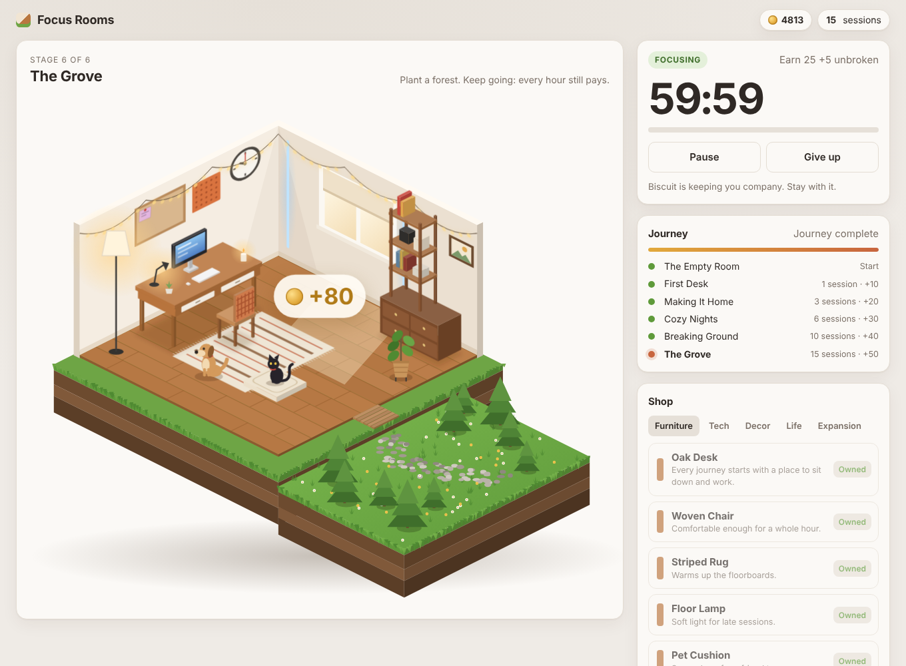

# Focus Rooms — prototype



Focus for an hour, earn coins, and build your room one piece at a time. You start with an empty isometric room. Each completed 60-minute focus session pays coins, and you spend them on furniture, decor, plants, a cat and, eventually, a garden. Biscuit the dog keeps you company and reacts to the timer.

## Run it

```bash
npm start      # serves on http://localhost:5173 (no install needed)
npm test       # 26 unit tests on Node's built-in runner
```

Requires Node 18 or later. There are no dependencies and no build step. Any static file server works too. The page has to be served over `http://` because it uses ES modules; opening the file directly won't work.

## Testing the end state quickly

The **Dev tools** card (shown by default; hide it with `?debug=0`) has:
- **Complete now** (or press `C`): finishes the running or paused session immediately and pays the reward.
- **Session length**: 60 min, 5 min, 1 min or 10 sec, for watching a real countdown finish.
- **+100 coins** and **Reset save**.

`Space` starts, pauses and resumes the timer.

## Docs

- [Game design document](docs/GAME_DESIGN.md): mechanics, items, writings, journey, progression flow
- [Prototype spec](docs/PROTOTYPE_SPEC.md): architecture, data models, state machine, UI sketch, scaffold, test plan
- [Filled-in prompt](docs/PROTOTYPE_PROMPT.md): the brief, with the `[FILL]` values that were chosen

## Layout

```
src/core/   pure game logic (timer state machine, economy, journey, reducer, save)
src/ui/     isometric SVG renderer, character sprites, DOM wiring
tests/      node:test suites
```
